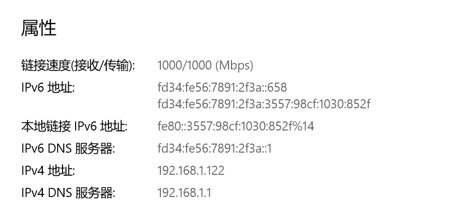
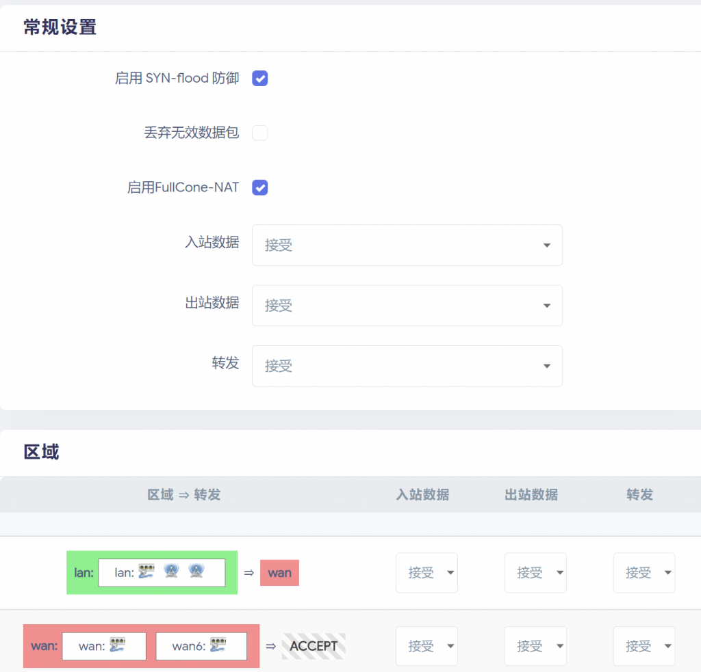
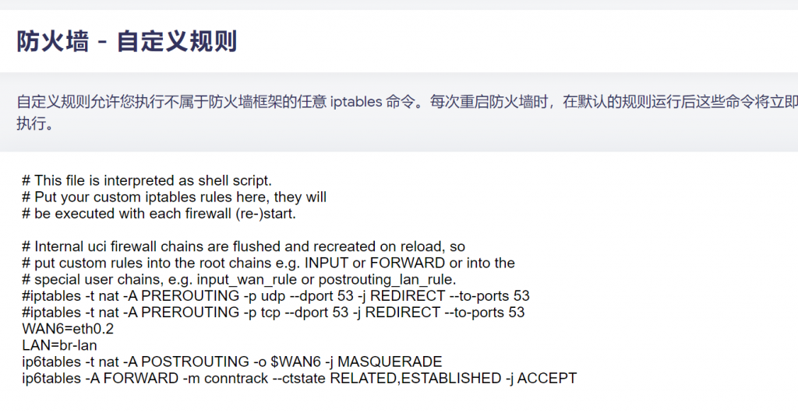
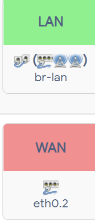
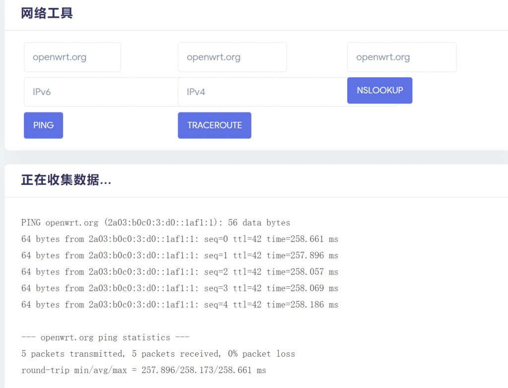
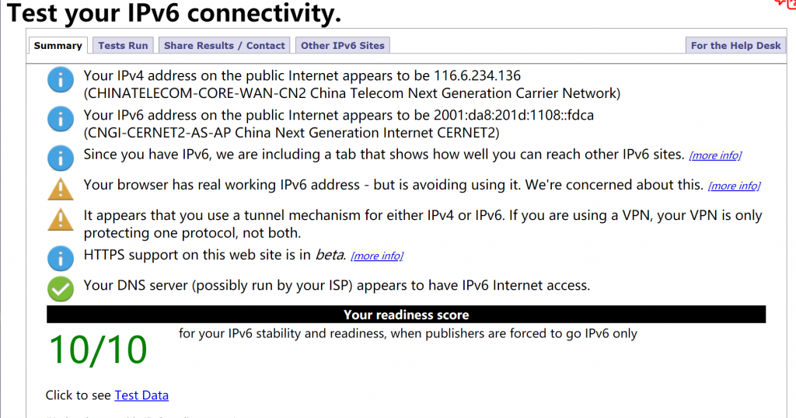

# 校内 IPv6 设置教程

本篇教程是在南方科技大学的网络环境下写成。据我所知，下发128位前缀 IPv6 地址的学校不止南科大一所，本篇教程事实上具有普适性，其他大学的同学也可以进行参考。

事实上，在中国电信的家宽一般下发56位前缀的地址，也可使用本方法，但并无必要，可直接由路由分配地址无需 NAT。

南科大的 IPv6 下发的地址是 128位前缀，换言之，子网大小为 1，仅够一台设备使用。为了让一个物理网口下的多个设备共享网络，常见的解决方案是（1）交换机（2）路由器。两者的区别想必需要用到此教程的同学应该了解，这里仅介绍具体配置。

## IPv6 桥接

根据工信部[《关于开展2019年IPv6网络就绪专项行动的通知》](https://www.miit.gov.cn/jgsj/txs/wjfb/art/2020/art_ed97eb9802da4f168acb823227663f1b.html) 的要求，“新部署的家庭网关设备应全部支持IPv6，并默认配置支持IPv4/IPv6双栈，能够为网关下挂设备分配 IPv6 地址”。同学们新购买的路由器应该都支持 IPv6。例如水星等，国产路由器一般会将 IPv6 与 IPv4的设置分开。

在南科大校园网下，在 IPv6 的设置中选择 “桥接模式” 或 ”中继模式“，下级设备应该能分配到 2001 开头的公网 IPv6 地址。

## IPv6 NAT ©️ 戴郭轶

一些同学如果有特殊需求可能会使用 OpenWrt，里面有丰富的插件提供多样的服务。

这篇教程可以说是一篇咕咕咕了很久的教程，大概是在去年才开学的时候，当时公网限速在 700KB/s，所以就买了新路由3刷了 OpenWrt 进行多拨来解除限速，（现在解除了，最快能够跑到 90MB/s 左右，没有必要使用多拨来提升带宽）。不过当时也花了很久配置 IPv6 的经验，可能仍值得分享。

由于南科大的分配的128位前缀的地址，子网空间不足，需要使用本该被淘汰掉的 NAT 网络地址转换使得下级设备能够联网，正确配置后的效果如下：


同时北洋园和蒲公英pt均能正常识别（需要在OpenWrt开启 UPnP ）：


**（PS：不要学我IPv6不打码直接发，因为 v6 默认就是公网地址，我在发完教程后会使用新的地址）**

电脑能成功获取内网IPv6,同时手机也能获得64位的 v6 地址，正常访问 v6 网络：



相应的流程并不复杂，只需要一台刷入OpenWrt的路由器，一台电脑，WinSCP（可选），以及足够的耐心。

首先，我们需要登录进入路由器的后台管理页面,依次点击网络-接口：

将全局网络选项前缀进行修改，我个人使用的是 `fd34:fe56:7891:2f3a::/64`；可以按照自己喜好选择一个内网前缀。


随后单击lan一栏的修改，我们需要修改一下内网的设置，滑到下方，点击高级设置，按照下图进行勾选：


然后点击IPv6设置，路由器通告服务和DHCPv6服务修改为服务器模式，NDP代理设置为禁用，DHCPv6选择无状态的+有状态的，并勾选总是通告默认路由：


完成后点击保存&应用。

随后进入wan口的设置，勾选上使用内置的IPv6管理


随后进入wan6口的设置，将协议修改为DHCPv6客户端，请求IPv6地址为force，请求指定长度的IPv6前缀为已禁用：


进入高级设置，勾选上使用内置的IPv6管理，强制链路和使用默认网关：


之后选择网络-DHCP/DNS，进入高级设置，取消勾选禁止解析IPv6 DNS记录：


进入网络-防火墙：

将转发改为接受，下面的区域也需要改：



进入自定义规则，粘贴如下内容：



```
WAN6=eth0.2
LAN=br-lan
ip6tables -t nat -A POSTROUTING -o $WAN6 -j MASQUERADE
ip6tables -A FORWARD -m conntrack --ctstate RELATED,ESTABLISHED -j ACCEPT
```

其中 `eth0.2` 和 `br-lan` 需要修改为你网络-接口中显示的内容：



2023.3.22 更新：

在新版本的linux/openwrt 中，iptables 已经被 nftables 取代，上述命令可能执行失败，我们可以使用以下命令来解决：
ip6tables -t nat -I POSTROUTING -s \`uci get network.globals.ula_prefix\` -j MASQUERADE
这样就无需上述防火墙自定义规则的配置了。

如果有多拨需求的，提醒一下需要在负载均衡中将 defalut-rule 的备用成员改成默认（使用主路由表），由于我重新刷机做的教程且现在没有多拨的必要，就不演示了，没有需求的可以略过这一点。

经过如上配置，重启路由器后，在网络，诊断中应该能够成功 ping 通 openwrt.org 的v6了，说明你的路由器已经成功接入 IPv6 网络了：



但是如果我们打开 [https://www.test-IPv6.com/](https://www.test-IPv6.com/) ，我们电脑还是没有连上v6的，这里就需要我们修改流量转发的路由表了，使用ssh工具连上路由器，没有的可以点击系统-TTYD终端：依次输入一下代码：

```shell
route -A inet6 add default gw fe80::3e8c:93ff:fed0:83c2 dev eth0.2
/etc/init.d/firewall restart
/etc/init.d/network restart
```

其中，第一行的fe80开头的一串v6地址需要修改为本机的默认网关，可以在状态-概览下获得，如图：


而后面的eth0.2就是你网口的编号了，和防火墙哪那里一样，这个时候我们再打开 [https://www.test-IPv6.com/](https://www.test-IPv6.com/) ，可以发现，我们电脑已经接入IPv6了：



但是，如果路由器关机重启后，我们刚才输入的三行代码会丢失，也就是会回到路由器有 IPv6 而电脑无法连接 IPv6 的状态，这个时候我们就需要编辑一个开机自启的脚本，让路由器再开机时自动添加：

具体操作为：使用 WinSCP 连接并登陆进入路由器，在 `/etc/hotplug.d/iface/` 目录下新建名为 `restart-IPv6` 的文件，修改内容为：

```shell
#!/bin/sh
[ "$ACTION" = ifup ] || exit 0
route -A inet6 add default gw fe80::3e8c:93ff:fed0:83c2 dev eth0.2
```

2023.3.22 更新：
如果无法在防火墙自定义规则处修改，请在脚本中添加相关命令。

最后一行需要修改成和刚才一样的内容，然后给予可执行权限。

没有 WinSCP 的可以在终端内输入以下内容：

```shell
vim /etc/hotplug.d/iface/restart-IPv6
```

然后再文本框中输入上面的三行内容，按 Esc 后退出 insert 模式，输入 `:wq` 退出。

然后给予可执行权限：

```shell
chmod +x /etc/hotplug.d/iface/restart-IPv6
```


这个时候，恭喜你，成功配置IPv6了哦~

对了，如果有挂pt需求的同学，别忘了在服务-UPnP中打开哦~

还存在一些应该是OpenWrt本身的问题，在使用IPv6的时候，无法手动配置端口转发，UPnP的端口转发是成功的，但是在防火墙下无法配置，使用 Socat 也没有成功。

感谢阅读！如果有什么问题或者建议，可以和我发邮件联系。

我的个人邮箱为：ntdgy2001@gmail.com / 12011211@mail.sustech.edu.cn

原文章地址（NAT 部分）©️ 戴郭轶：[[https://ntdgy.top/ntdgy/30/](https://ntdgy.top/ntdgy/30.html)]


# IPv6 (Linux systemd)

学校的 DHCPv6 服务器实现比较灵车，Linux桌面或服务器有时候无法获取到 IPv6 地址，如果你使用 systemd-networkd 配置网络，你可以使用以下设置：

注意要让 systemd-networkd 接管网络配置。

创建 `/etc/systemd/network/wan.network`，文件一定要以 .network 结尾。

```
[Match]
Name=`interface`

[Network]
DHCP=yes
IPv6AcceptRA=true

[DHCPv6]
WithoutRA=solicit
DUIDType=link-layer
RapidCommit=false

[IPv6AcceptRA]
Token=eui64
DHCPv6Client=always
```

关键是要把 `RapidCommit=false` 关掉，带上这个标志后学校 DHCPv6 服务器就不会回复 DHCPv6 Solicit 请求。

有时候学校二层里面也不会发 IPv6 RA，所以最好启用 `WithoutRA=solicit` 强制启动 DHCPv6 流程。

Openwrt的客户端并不会带上 RapidCommit，所以没有啥问题。

